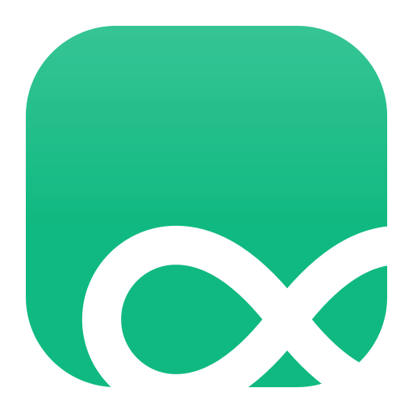

# Infinite Clipboard

<p align="center">
  
</p>

**[English](README.md)** | 한국어

[](https://github.com/dispather/infinite-clipboard/releases)
[](LICENSE)

**클립보드 하나로, 내 모든 PC가 하나처럼.**

파일 하나 옮기려고 나에게 AirDrop 하거나, 내 메일로 보내거나, Slack DM 에 붙여넣던 일은 이제 그만. Infinite Clipboard 는 Windows, macOS, Linux 할 것 없이 내가 가진 모든 PC를 내 Tailscale 네트워크 위에서 자동으로 동기화한다.

- 📋 **즉시 텍스트 동기화** — 한 PC 에서 복사하면 연결된 다른 모든 PC 클립보드에 바로 들어가 있다
- 📁 **필요할 때만 전송되는 파일/폴더** — 복사는 그저 "받을 수 있다"는 신호만 보낼 뿐, 실제로 붙여넣는 순간에만 전송이 시작된다. 안 쓰는 PC 에 불필요한 데이터가 쌓이지 않는다. 전송이 끊겨도 자동으로 이어받는다
- 🖼️ **이미지도 동일하게** — 스크린샷과 복사한 이미지도 같은 방식으로 동기화
- 🔒 **설계부터 프라이빗** — 내 Tailscale(WireGuard) 네트워크로만 흐르며 공유 키로 접근을 제한한다. 중간에 어떤 클라우드 서비스도 끼지 않는다
- 🖥️ **트레이에 상주** — 각 PC 에 한 번만 설정해두면 실행 중인 걸 잊고 지내도 된다

---

## 설치

[GitHub Releases](https://github.com/dispather/infinite-clipboard/releases) 페이지에서 OS 별 패키지를 받아 설치한다. 모든 PC의 `auth_key`는 **반드시 동일해야** 한다 (아래 "최초 1회 키 공유" 참조).

| OS | 파일 (X.Y.Z = 버전) | 설치 방법 |
|----|---------------------|-----------|
| Linux (Arch/CachyOS) | `infinite-clipboard-X.Y.Z-1-x86_64.pkg.tar.zst` | `sudo pacman -U <파일>` |
| macOS (Apple Silicon) | `Infinite Clipboard X.Y.Z.dmg` | DMG 열기 → `/Applications`로 드래그 → **아래 Gatekeeper 우회 필수** |
| Windows | `infinite-clipboard-setup-X.Y.Z.exe` | 설치 프로그램 실행 → 안내 따르기 (per-user, 관리자 권한 불필요) |

설치 후:
- Linux: 애플리케이션 메뉴 → Infinite Clipboard
- macOS: 런치패드 또는 `open "/Applications/Infinite Clipboard.app"`. 아래 Gatekeeper 우회를 먼저 수행해야 정상 실행됨
- Windows: 시작 메뉴 → Infinite Clipboard (설치 시 "자동 시작" 체크 가능)

### macOS Gatekeeper 우회 (1회 필수)

DMG 가 코드 서명되어 있지 않아 macOS 가 quarantine 속성을 붙여 차단한다 ("Apple은 ... 악성 코드가 없음을 확인할 수 없습니다"). 다음 명령으로 1회 해제한다:

```sh
xattr -dr com.apple.quarantine "/Applications/Infinite Clipboard.app"
```

해제 후엔 일반 앱처럼 실행 + 자동 시작 가능. 새 버전을 받아 덮어쓸 때마다 같은 명령을 1회 다시 실행해야 한다.

> 우클릭 → 열기 방식은 unsigned ARM64 빌드에서 차단 다이얼로그가 그대로 떠 작동하지 않을 수 있다. `xattr` 명령이 가장 확실하다.

### 최초 1회 키 공유

앱은 첫 실행 시 각 PC별로 랜덤 `auth_key`를 자동 생성한다. PC 간 연결이 되려면 모든 PC가 같은 키를 가져야 한다.

```
1. PC A에서 앱 실행 → 설정 폴더의 settings.json 에 auth_key 생성
2. PC A의 auth_key 값을 복사
3. 다른 PC의 settings.json 의 auth_key 에 동일한 값 붙여넣기 + 앱 재시작
   (또는 트레이 → 설정 → Auth Key 에 직접 입력)
```

설정 파일 위치:

| OS | 경로 |
|----|------|
| Linux | `~/.config/InfiniteClipboard/settings.json` |
| macOS | `~/Library/Application Support/InfiniteClipboard/settings.json` |
| Windows | `%APPDATA%\InfiniteClipboard\settings.json` |

---

## 사용법

- **텍스트 공유**: 아무 PC에서 Ctrl+C → 연결된 모든 PC에 즉시 동기화 (별도 조작 불필요)
- **파일/이미지 전송 (lazy)**: 파일/폴더/이미지를 복사하면 다른 PC들에 "받을 수 있다"는 알림만 간다. 실제 전송은 그 PC에서 **Ctrl+V 하거나, 트레이 → Transfers 창의 "받기" 버튼을 눌러야** 시작된다(복사만 해도 자동으로 전송되지 않음). 완료되면 `~/Downloads/` (또는 설정한 경로)에 저장
- **설정 변경**: 트레이 아이콘 우클릭 → Settings
- **이력 확인**: 트레이 아이콘 우클릭 → Clipboard History
- **전송 진행률/받기**: 트레이 아이콘 우클릭 → Transfers
- **자동 시작**: 설정창에 "OS 시작 시 자동 실행" 스위치

### 트레이 아이콘 색상

| 색상 | 의미 |
|------|------|
| 초록 | 서버: 클라이언트 연결됨 / 클라이언트: 서버 연결됨 |
| 노랑 | 서버 대기 중 (클라이언트 없음) |
| 빨강 | 클라이언트 연결 끊김 |
| 회색 | 초기 상태 |

---

## 네트워크 구성

```
[서버 PC — 항상 켜짐]              [클라이언트 PC들]
  Tailscale IP: 100.64.0.1         Tailscale IP: 100.64.0.x
       │                                  │
       └──────── Tailscale VPN ────────────┘
                    (WireGuard 암호화)
```

- 서버 PC 1대 고정, 나머지는 클라이언트
- Tailscale 의 WireGuard 가 암호화를 담당 → 앱 레벨 암호화 없음
- 서버 재시작 시 클라이언트 자동 재연결 (기본 5초 간격)
- 기본 포트 `9999`

### 방화벽

Tailscale 만 사용한다면 대부분 추가 설정 없이 동작. LAN에서 직접 연결하는 경우:

```bash
# Linux (ufw)
sudo ufw allow 9999/tcp

# Windows PowerShell (관리자)
New-NetFirewallRule -DisplayName "Infinite Clipboard" -Direction Inbound -Protocol TCP -LocalPort 9999 -Action Allow

# macOS
# 시스템 설정 → 네트워크 → 방화벽 → 앱 허용에 InfiniteClipboard 추가
```

---

## 트러블슈팅

### macOS 첫 실행 시 "확인되지 않은 개발자" 경고
Gatekeeper가 ad-hoc 서명된 앱을 막음. Finder에서 `.app` 을 **우클릭 → 열기** 로 1회 통과하면 이후 정상 실행.

### 연결이 안 됨 — "인증 실패"
모든 PC의 `auth_key` 값이 완전히 동일한지 확인. 한 글자라도 다르면 실패. 가장 확실한 방법: 서버 PC의 `settings.json` 을 복사해 클라이언트 PC에 덮어쓰기.

### 파일 전송이 도중에 멈춤
자동 이어받기가 구현되어 있음. 앱을 재시작하면 체크포인트(`~/.config/InfiniteClipboard/checkpoints/` 또는 각 OS 설정 폴더)에서 재개. 이어받기도 실패하면 임시 디렉토리(`/tmp/ic_transfer_<id>/` 등)를 수동 삭제 후 재전송.

### Windows 인스톨러에서 SmartScreen 경고
정식 코드 사이닝 인증서가 없어 발생. "추가 정보" → "실행" 클릭. 코드 사이닝이 필요하면 별도 인증서 구매 후 `signtool` 로 서명.

### 버전 업데이트 확인
```bash
infinite-clipboard --version
```

---

## 소스 빌드 / 기여

직접 네이티브 패키지를 빌드하거나, 개발자 모드로 실행하거나, 코드에 기여하고 싶다면 **[CONTRIBUTING.ko.md](CONTRIBUTING.ko.md)**를 참고한다.

## 후원

Infinite Clipboard 가 복사-붙여넣기 번거로움을 덜어줬다면, 커피 한 잔으로 후원할 수 있다 — 유지보수에 도움이 된다.

[](https://ko-fi.com/dispather)

## 라이선스

MIT License — 자세한 내용은 `LICENSE` 파일 참조.
