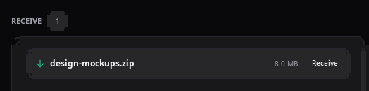
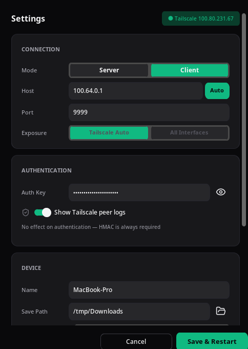
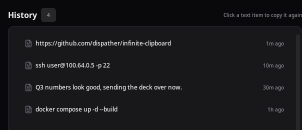

# Infinite Clipboard

<p align="center">
  
</p>

English | **[한국어](README.ko.md)**

[](https://github.com/dispather/infinite-clipboard/releases)
[](LICENSE)

**One clipboard, every PC.**

Stop AirDropping to yourself, emailing files to your own inbox, or pasting into a Slack DM just to move something between your own computers. Infinite Clipboard keeps every PC you own — Windows, macOS, Linux — in sync automatically, over your own Tailscale network.

- 📋 **Instant text sync** — copy on one PC, it's already on the clipboard of every other connected PC
- 📁 **On-demand file & folder transfer** — copying just makes a file available; it only transfers when you actually paste it elsewhere, so idle PCs never get clogged with data they don't need. Interrupted transfers resume automatically
- 🖼️ **Images sync too** — screenshots and copied images work the same way
- 🔒 **Private by design** — travels over your own Tailscale (WireGuard) network, gated by a shared key — no cloud service sits in the middle
- 🖥️ **Lives in your tray** — set it up once on each PC, forget it's running

<p align="center">
  
</p>

---

## Install

Download the package for your OS from the [GitHub Releases](https://github.com/dispather/infinite-clipboard/releases) page. Every PC's `auth_key` **must match exactly** (see "Share the key once" below).

| OS | File (X.Y.Z = version) | Install |
|----|------------------------|---------|
| Linux (Arch/CachyOS) | `infinite-clipboard-X.Y.Z-1-x86_64.pkg.tar.zst` | `sudo pacman -U <file>` |
| macOS (Apple Silicon) | `Infinite Clipboard X.Y.Z.dmg` | Open the DMG → drag to `/Applications` → **Gatekeeper bypass required, see below** |
| Windows | `infinite-clipboard-setup-X.Y.Z.exe` | Run the installer and follow the prompts (per-user, no admin rights needed) |

After installing:
- Linux: Application menu → Infinite Clipboard
- macOS: Launchpad, or `open "/Applications/Infinite Clipboard.app"`. Run the Gatekeeper bypass below first or it won't launch
- Windows: Start menu → Infinite Clipboard (you can check "start automatically" during install)

### macOS Gatekeeper bypass (one-time)

The DMG isn't code-signed, so macOS quarantines it ("Apple could not verify this app is free of malware..."). Clear the quarantine flag once with:

```sh
xattr -dr com.apple.quarantine "/Applications/Infinite Clipboard.app"
```

After that it runs and auto-starts like any normal app. You'll need to re-run this command once whenever you overwrite it with a new version.

> Right-click → Open doesn't reliably work around the block on unsigned ARM64 builds — the `xattr` command is the reliable fix.

### Share the auth key once

On first launch, each PC generates its own random `auth_key`. For PCs to connect to each other, they all need the same key.

```
1. Launch the app on PC A → auth_key is generated in that PC's settings.json
2. Copy PC A's auth_key value
3. Paste the same value into auth_key in the other PC's settings.json + restart the app
   (or type it directly into Tray → Settings → Auth Key)
```

Settings file locations:

| OS | Path |
|----|------|
| Linux | `~/.config/InfiniteClipboard/settings.json` |
| macOS | `~/Library/Application Support/InfiniteClipboard/settings.json` |
| Windows | `%APPDATA%\InfiniteClipboard\settings.json` |

---

## Usage

- **Text sharing**: Ctrl+C on any PC → syncs instantly to every connected PC, no extra steps
- **File/image transfer (lazy)**: copying a file/folder/image just notifies the other PCs that something is available — the actual transfer only starts when you **press Ctrl+V on that PC, or click "Receive" in the tray's Transfers window** (copying alone never auto-transfers). Once complete, it's saved to `~/Downloads/` (or your configured path)
- **Settings**: right-click the tray icon → Settings
- **History**: right-click the tray icon → Clipboard History
- **Transfer progress / receiving**: right-click the tray icon → Transfers
- **Autostart**: toggle "Start automatically" in the settings window

<p align="center">
  
  &nbsp;&nbsp;
  
</p>

### Tray icon colors

| Color | Meaning |
|-------|---------|
| Green | Server: a client is connected / Client: connected to server |
| Yellow | Server waiting (no clients connected) |
| Red | Client disconnected |
| Gray | Initial state |

---

## Network setup

```
[Server PC — always on]            [Client PCs]
  Tailscale IP: 100.64.0.1         Tailscale IP: 100.64.0.x
       │                                  │
       └──────── Tailscale VPN ────────────┘
                    (WireGuard encryption)
```

- One fixed server PC, the rest are clients
- Tailscale's WireGuard handles encryption — there's no additional app-level encryption
- Clients auto-reconnect if the server restarts (5s interval by default)
- Default port `9999`

### Firewall

Works out of the box in most setups if you're only using Tailscale. For a direct LAN connection:

```bash
# Linux (ufw)
sudo ufw allow 9999/tcp

# Windows PowerShell (as Administrator)
New-NetFirewallRule -DisplayName "Infinite Clipboard" -Direction Inbound -Protocol TCP -LocalPort 9999 -Action Allow

# macOS
# System Settings → Network → Firewall → allow InfiniteClipboard
```

---

## Troubleshooting

### "Unidentified developer" warning on first macOS launch
Gatekeeper is blocking the ad-hoc signed app. Right-click the `.app` in Finder → Open, once, and it'll launch normally after that.

### Can't connect — "authentication failed"
Make sure every PC's `auth_key` matches exactly — a single character off will fail. The most reliable fix: copy the server PC's `settings.json` and overwrite it on the client PCs.

### File transfer stalls partway through
Automatic resume is built in. Restart the app and it'll pick up from the checkpoint (`~/.config/InfiniteClipboard/checkpoints/` or the equivalent settings folder per OS). If resume also fails, manually delete the temp directory (e.g. `/tmp/ic_transfer_<id>/`) and retry the transfer.

### SmartScreen warning on the Windows installer
Happens because there's no proper code-signing certificate. Click "More info" → "Run anyway". If you need code signing, buy a certificate and sign with `signtool`.

### Check the installed version
```bash
infinite-clipboard --version
```

---

## Building from source / Contributing

Want to build a native package yourself, run in developer mode, or contribute code? See **[CONTRIBUTING.md](CONTRIBUTING.md)**.

## Support

If Infinite Clipboard saves you some copy-pasting hassle, consider buying me a coffee — it helps keep this maintained.

[](https://ko-fi.com/dispather)

## License

MIT License — see the `LICENSE` file for details.
